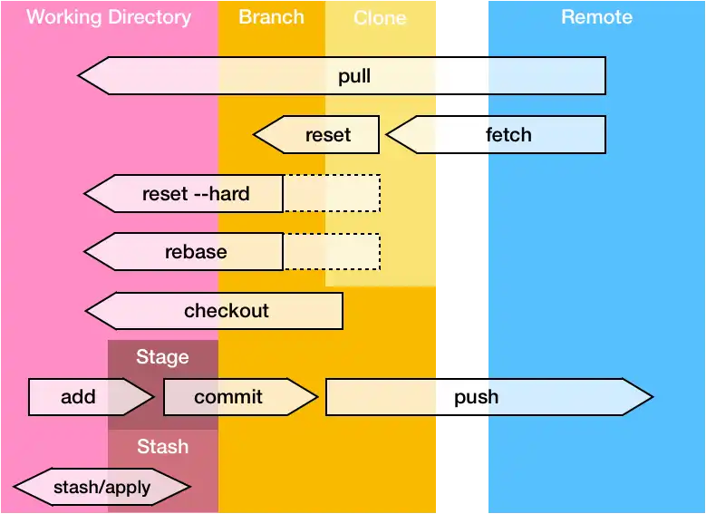
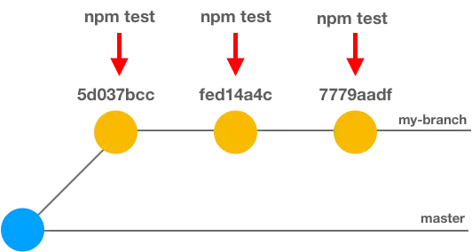

<a href="../README.md">
<button>⬅Back</button>
</a>

# Git: Cheat Sheet (advanced)

If you find git confusing, I created this little cheat sheet! Please, note that I voluntarily skipped the basic commands like `git commit`, `git pull/push`… This cheat sheet is intended for advanced usage of git.

<center>

</center>

## 🧭 Navigation - Go to the previous branch

```bash
git checkout -
```

## 🔍 Get the history

```bash
# Log in one line
git log --oneline

# Retrieve all commits by message
# Here all commit that contain 'homepage'
git log --all --grep='homepage'

# Retrieve all commit by author
git log --author="Maxence"
```

## 🙈Ooops #1: I reseted an unwanted commit. How to rollback?

```bash
# Get everything you did
git reflog

# then reset to the desired commit (i.e. HEAD@{4})
git reset HEAD@{4}
# ...or...
git reset --hard <commit-sha1>
```
For more detail about this command, I wrote another post: [What’s happens when you ‘git commit’.](https://www.maxpou.fr/git-under-the-hood)

## 🤦‍♀️Ooops #2: I mixed-up with my local repo. How to clean it?

```bash
git fetch origin
git checkout master
git reset --hard origin/master
# You're now up-to-date with master!
```

## 🕵🏻‍♂️Difference between my branch and `master`

```bash
git diff master..my-branch
```

## ✔ Custom commits

```bash
# Edit last commit
git commit --amend -m "A better message"

# Add something to the last commit without writing message again
git add . && git commit --amend --no-edit

# empty commit - can be useful to re-trigger CI build...
git commit --allow-empty -m "chore: re-trigger build"
```
*If you don’t know what to put in your commit messages, I wrote a [post about conventional commits.](https://www.maxpou.fr/git-conventional-commits)* 

## ♻️ Squash commits 

*Let say I want to rebase the last 3 commits:*

1. `git rebase -i HEAD~3`
2. Leave the first “pick” and replace the rest by ”`squash`” (or ”`s`“)
3. Tidy up the commit message and save (`:wq` in vi).

👉 [Click here for watch the YouTube video](https://www.youtube.com/watch?v=Waa9A_h4eHI&ab_channel=MaxencePoutord)

## 🎯Fixup

*Let say I want to add something in the commit `fed14a4c`*

<center>

</center>

```bash
git add .

git commit --fixup HEAD~1
# or replace HEAD~1 by the commit hash (fed14a4c)

git rebase -i HEAD~3 --autosquash
# save&quit the file (:wq in VI)
```

## 🕹Execute command on each commit when rebasing

For massives features, you might end up with a branch with a few commits inside. And then tests are failing and you want to identify the “guilty commit”. You can use `rebase --exec` to execute a command on each commit of the history.

```bash
# Will run "npm test" command on the last 3 commit ❤️
git rebase HEAD~3 --exec "npm run test"
```
<center>

</center>

## 🦋Stash

*Because it’s not all about `git stash` and `git stash pop`* ;)

```bash
# save all tracked files
git stash save "your message"

# list your stashes
git stash list

# retrieve stash and delete
git stash apply stash@{1}
git stash drop stash@{1}
# ... or in 1 command
git stash pop stash@{1}
```

## 🗑 Clean

```bash
# remove branches that no longer exist on remote
git fetch -p

# remove all branch that contains "greenkeeper"
git fetch -p && git branch --remote | fgrep greenkeeper | sed 's/^.\{9\}//' | xargs git push origin --delete
```

## 🦄 Bonus: my favourite git aliases

```bash
alias g='git'
alias glog='git log --oneline --decorate --graph'
alias gst='git status'
alias gp='git push'
alias ga='git add'
alias gc='git commit -v'

# 🤘
alias yolo='git push --force'

# useful for daily stand-up
git-standup() {
    AUTHOR=${AUTHOR:="`git config user.name`"}

    since=yesterday
    if [[ $(date +%u) == 1 ]] ; then
        since="2 days ago"
    fi

    git log --all --since "$since" --oneline --author="$AUTHOR"
}
```

## 📃 Source

[https://dev.to/maxpou/git-cheat-sheet-advanced-3a17](https://dev.to/maxpou/git-cheat-sheet-advanced-3a17)